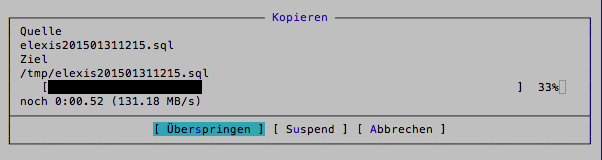
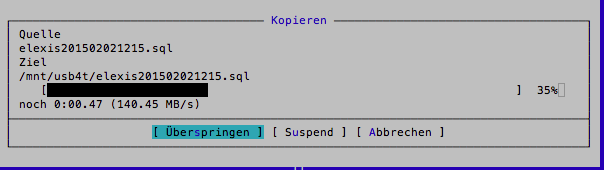
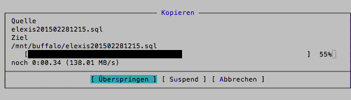

## Geschwindigkeitsvergleich einiger externer Speichermethoden auf dem Server.

Natürlich sind real-world-examples weniger reproduzierbar und somit weniger aussagekräftig, als standardisierte Screenshots.
Daher der disclaimer: Diese Beispiel gelten nur für mein System und nur für den Zeitpunkt, zu dem sie ausgeführt wurden.

* System: Fujitsu Primergy TX 150 S2  
* Prozessor:  Intel(R) Xeon(R) CPU E3-1265L v3 @ 2.50GHz
* RAM: 32 GB
* OS: Ubuntu 14.04 LTS Server x64

Dreimal derselbe Test: eine grosse (10GB) Datei kopieren. Jedesmal eine andere, um cache-Effekte zu minimieren.
Quellverzeichnis liegt auf einer internen SATA-Harddisk

### 1. Kopie auf eine zweite interne SATA Harddisk auf demselben Computer

### 2. Kopie auf USB-Platten

(Genauer gesagt: Ein ZFS virtual device, bestehend aus zwei gespiegelten 4-TB-Platten an USB-3-Ports) mit einem
transparent komprimierenden Dateisystem (zfs set compression=lz4)

### 3. Kopie auf NAS

(6 TB Buffalo LinkStation an Gigabyte-Lan)

## Fazit

* Nur beim NAS wird die möglicher Schnittstellengeschwindigkeit halbwegs ausgenutzt. Sowohl hei SATA als auch bei USB 3 
sind allein die Platten der limitierende Faktor.

* Weder Kompression noch Spiegelung scheinen bei ZFS allzu viel Zeit zu kosten

* Wieso eigentlich interne Platten? Externe Platten an USB sind einfacher zu handeln, problemlos im laufenden Betrieb ersetzbar und 
zumindest in diesem Szenario genau so schnell.

